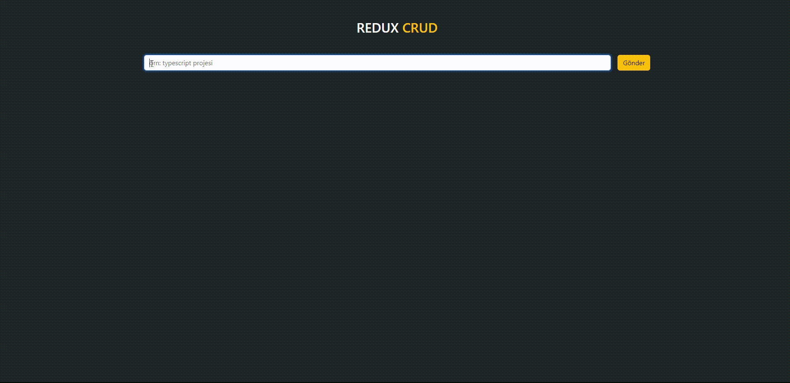

# State Yönetimi

- State: Uygulamadaki bileşenlerin sahip olduğu bilgi ve özellikler.Bu bilgi her değiştiğinde bileşenin tekrar render edilmesine sebep olur.bileşenden farkı budur.

- Prop Drilling: Bileşenlerin yukarıdan aşağıya veri taşıması.

- Context: Uygulamadaki state'i bütün bileşenler tarafından erişilebilen ve oluşturduğumuz merkezlerden yönettiğimiz state yönetim aracı.

- Redux: Bileşenlerin sahip olduğu ve merkezi olarak tutulması gereken state'lerin yönetildiği merkezi state yönetim aracı.

# Neden Context yerine Redux ?

- Kod tekrarını önler
- Performansı daha iyi
- Bileşen içerisndeki karışıklığı azaltır
- Hata ayıklama daha kolaydır
- Orta ve büyük ölçekli projelerde state yönetmini daha kolay hale getirir

# Redux ile ilgili bilinmesi gerekenler

1. Store: Uygulamanın bütün bileşenleri tarafından erişilebilen ve yönetilebilen state deposu

2. Reducer: Aksiyondan aldığı talimata göre store'da tutulan state'in nasıl değişeceğine karar veren fonksiyon

3. Action: Store'daki state'i güncellemek için reduce'a gönderdiğimiz nesne. (emir | haber | eylem)

- Action iki değere bir nesnedir:

- - type (zorunlu): Action'ın görevini tanımlayan string

- - payload (opsiyonel): Action'ın verisi

4. Dispatch (Sevketmek): Action'un gerçekleştiğ'ini reducer'a haber veren method

5. Subscribe (Abone Olmak): Bileşen'lerin store'da tutulan veriye erişimini sağlaması. (useContext,useSelector)

6. Provider (Sağlayıcı): Store'da tutulan verileri uygulamaya sağlar.

# Gerçek Hayattan Benzetme

- Store: Okul Binası

- Reducer: Okulun Yönetim Ekibi (Müdür, Müdür Yard.)

- Action: "Öğrenci Sınavı Geçmesi" | "Yeni Öğrencini Kayıt Yapması" | "Öğrencinin Okuldan Atılması"

- Dispatch (Sevketmek): Öğrenci İşleri | Öğretmen

- Subscribe (Abone Olmak): Rehberlik Servisi | E-Okul

- Provider (Sağlayıcı): Okul Aile Birliği | MEB

# Redux Kurulum Aşamaları

1. `redux` ve `react-redux` paketlerini indir
2. reducer / reducer'ların kurlumunu yap
3. store'un kurlumunu yap
4. store'u projeye tanıt >> (main.jsx de Provider import et,app sarmala,store import et,provider store propu gönder)

# Proje geliştiştirirken sıklıkla karşılaştığımız hatalar

- - Yapılan güncelleme ekrana yansır ama sayfa yenilenince kaybolur
    > > state doğru güncellendi
    > > api yanlış güncellendi (güncellemeyi then bloğu içine al)

- - Yapılan güncelleme ekrana yansımaz sayfa yenilenince düzelir

    > > state yanlış güncellendi (usestate ise usestatei , contexte ise value ve provider ,reduxta dispatch,action,type ,reducer kontrol et)
    > > api doğru güncellendi

    
